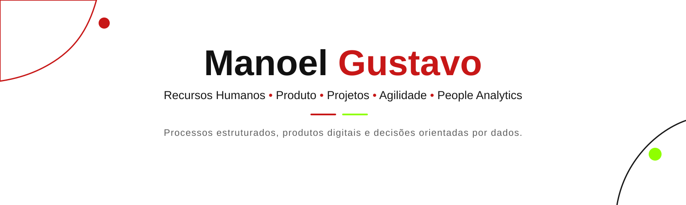

# Manoel Gustavo

**Recursos Humanos · Produto · Projetos · Agilidade · People Analytics**

> Transformo necessidades de negócio em processos estruturados, produtos digitais e decisões orientadas por dados.

[**Portfólio**](https://gustavomrtns.github.io/projetos_rh/) · [**LinkedIn**](https://www.linkedin.com/in/manoel-gustavo/) · [**Cases**](https://github.com/gustavomrtns/projetos_rh)

---

## Áreas de atuação

**Pessoas & Negócio**  
Gestão de Pessoas · Employee Experience · Cultura · Engajamento · Psicologia Organizacional

**Produto & Projetos**  
Necessidades · Escopo · Requisitos Funcionais · Stakeholders · Priorização · Experiência do Usuário

**Agilidade & Processos**  
Scrum · Kanban · Sprints · Gestão Visual · Mapeamento de Processos · Melhoria Contínua

**Dados & Tecnologia**  
People Analytics · Power BI · Python · SQL · IA aplicada a RH · HTML/CSS/JS

---

## Projetos em destaque

### GT360º
**Workspace de Gestão de Talentos**

Solução digital voltada à organização de processos de onboarding e Treinamento & Desenvolvimento, estruturando fluxos, requisitos funcionais, priorização e indicadores em um único ambiente.

`Product Thinking` · `Gestão de Pessoas` · `Requisitos Funcionais` · `People Analytics`

[**Ver case →**](https://github.com/gustavomrtns/projetos_rh/tree/main/gt360) · [**Abrir aplicação →**](https://gustavomrtns.github.io/projetos_rh/gt360/)

### eu + horizonte
**Intranet · Employee Experience**

Produto digital voltado à comunicação interna, cultura e experiência do colaborador, conectando informação, jornada e experiência de uso.

`Employee Experience` · `Produto Digital` · `Comunicação` · `UX`

[**Ver case →**](https://github.com/gustavomrtns/projetos_rh/tree/main/eu-horizonte-intranet) · [**Abrir aplicação →**](https://gustavomrtns.github.io/projetos_rh/eu-horizonte-intranet/)

[**Ver todos os projetos →**](https://github.com/gustavomrtns/projetos_rh)

---

## Como estruturo os cases

**Contexto → Problema → Usuários/Stakeholders → Necessidades → Minha atuação → Requisitos e fluxo → Solução → Indicadores → Valor potencial → Aprendizados**

O foco está no **raciocínio de negócio, produto e processo**. Nos projetos demonstrativos, indicadores e dashboards conceituais são utilizados para representar possibilidades analíticas sem atribuir resultados reais que não tenham sido mensurados.

### Stack e abordagens aplicadas

**Produto & Projetos:** levantamento de necessidades · escopo · requisitos funcionais · priorização · stakeholders · experiência do usuário · indicadores  
**Agilidade & Processos:** Scrum · Kanban · sprints · gestão visual · mapeamento de processos · melhoria contínua · OKRs  
**Gestão de Pessoas:** T&D · Onboarding · Offboarding · Performance · Employee Experience · Comunicação Interna  
**People Analytics & Dados:** Power BI · SQL · Python · indicadores · dashboards · pesquisa organizacional  
**Soluções digitais:** HTML · CSS · JavaScript · IA aplicada a RH · automação de fluxos

> **Nota de posicionamento:** os cases evidenciam competências transferíveis para Product Owner, Product Analyst, Agile Analyst e Agilidade. Não atribuo a mim experiências formais de Scrum Master ou Product Owner quando elas não ocorreram nesses cargos.

---

## Formação e desenvolvimento

- **MBA em Gestão de Projetos — USP/ESALQ** · em andamento
- **Bacharelado em Psicologia — Faculdade Santa Teresa** · em andamento
- **Gestão de Recursos Humanos — Faculdade Martha Falcão** · concluído
- **Análise Técnica Comportamental DISC — Freedom Start** · certificado

Formação complementar em **People Analytics, ESG, Departamento Pessoal, Indicadores de T&D, IA aplicada a RH, Tech Recruiter, Metodologias Ágeis e Análise de Dados**.

---

## Conecte-se comigo

[**LinkedIn**](https://www.linkedin.com/in/manoel-gustavo/) · [**Portfólio Profissional**](https://gustavomrtns.github.io/projetos_rh/) · [**Repositório de Projetos**](https://github.com/gustavomrtns/projetos_rh)
